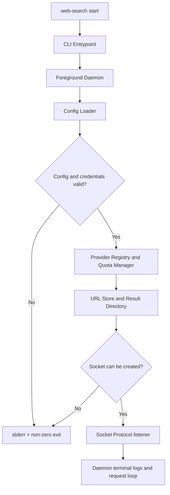
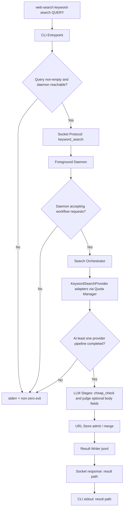
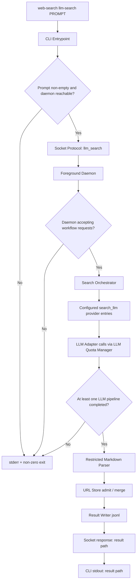
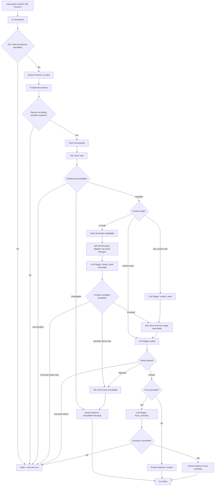
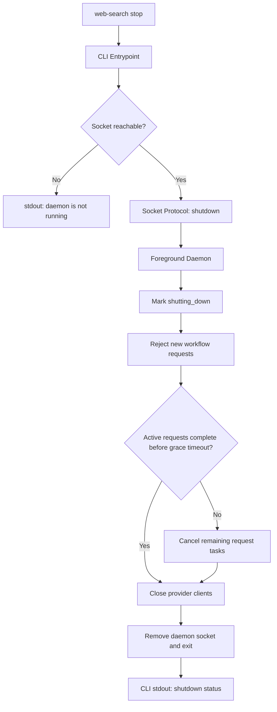

## Architecture: Web Search CLI

### 1. Scope & Assumptions

#### In Scope

- A first-version Python CLI and foreground daemon with manual start and graceful stop commands.
- Three user-facing workflows: `keyword-search`, `llm-search`, and `url-fetch`.
- In-memory URL state with the public five-field URL object: `url`, `raw_content`, `content`, `abstract`, `available`.
- Keyword search and URL fetch provider adapters behind common contracts.
- OpenAI-compatible chat-completions LLM calls using direct HTTP requests.
- Provider-level concurrency control and per-URL fetch singleflight.

#### Todo

What this architecture intentionally does not cover, but could be addressed in the future:

- Runtime LLM provider failover.
- Anthropic, Gemini, and OpenAI Responses adapters.
- MCP server transport using the same core orchestrators.
- Direct arbitrary URL fetch without prior search admission.
- Query-specific abstracts. `abstract` is a URL field and follows first-write semantics.
- Structured CLI output modes such as `--json`.
- Streaming progress events from daemon to CLI.

#### Assumptions

- The user starts the daemon manually with `web-search start` and stops it with `web-search stop`.
- The daemon is the only owner of mutable URL state.
- Network failures are treated as execution failures, not as URL semantics.
- `available=false` is terminal for the daemon lifetime.
- A URL without a non-empty abstract is not useful to the user and is discarded during search.

---

### 2. Architecture Summary

The CLI is a thin client that sends one newline-delimited JSON request to a foreground daemon over a Unix domain socket. The daemon owns config, provider clients, concurrency controls, and in-memory URL state. Search commands call enabled providers, normalize and merge URL records, validate provider-supplied body fields before writing them, and emit a jsonl file containing only `url` and `abstract`. `url-fetch` only accepts URLs already admitted by search, prepares stable `content` through URL fetch providers and LLM cleaning when needed, safety-checks final content, and returns either full content or a request-local focus summary. `stop` asks the daemon to shut itself down gracefully through the same socket protocol.

---

### 3. Design Decisions

#### Runtime Model

##### Foreground Daemon With Thin CLI

- Description: Users run `web-search start` in one terminal. Other commands connect to `~/.cache/web-search-cli/daemon.sock`. `web-search stop` sends a shutdown request through that socket.

- Rationale: This keeps CLI arguments small while preserving shared in-memory state across multiple CLI invocations.

- Trade-offs: The user must keep the daemon terminal open. If it stops, all in-memory URL state is lost.

- Rejected Alternatives:
  - Pure one-shot CLI:
    - Description: Every command starts and exits independently.
    - Why Rejected: `url-fetch <url>` would not know prior search state without adding persistent storage or extra path arguments.
  - Auto-start daemon:
    - Description: CLI starts the daemon when the socket is missing.
    - Why Rejected: First version would need stale socket handling, duplicate startup prevention, daemon log routing, and version checks.

##### Graceful Stop Command

- Description: `web-search stop` sends a `shutdown` request to the daemon. The daemon enters shutting-down state, stops accepting new workflow requests, lets active requests finish up to a fixed internal grace timeout, closes provider clients, removes the socket file, and exits.

- Rationale: The daemon owns mutable in-memory state and provider clients, so it should shut itself down rather than be killed externally.

- Trade-offs: A stop request can wait behind long-running active requests. If the grace timeout expires, remaining work is cancelled and callers may see execution or protocol errors.

- Rejected Alternatives:
  - Direct process kill:
    - Description: Store a PID and have the CLI terminate it.
    - Why Rejected: It bypasses cleanup and is less portable across future daemon implementations.
  - Configurable stop flags:
    - Description: Add options such as `--force`, `--timeout`, or `--no-wait`.
    - Why Rejected: These are useful later, but they add CLI surface area before the first version needs it.

##### Python First Version

- Description: Implement the first version with Python, `uv`, `argparse`, and `httpx`.

- Rationale: Python keeps the first version fast to iterate on, especially while provider behavior and product semantics are still being finalized.

- Trade-offs: Python distribution and long-running daemon ergonomics are weaker than a single Rust binary.

- Rejected Alternatives:
  - Rust first version:
    - Description: Build the CLI/daemon in Rust from the start.
    - Why Rejected: Better long-term packaging, but slower for this exploratory version, especially around async shared state and provider adapters.

#### Interface / Protocol

##### Single CLI Entry Point

- Description: Use subcommands under one executable: `web-search start`, `web-search stop`, `web-search keyword-search`, `web-search llm-search`, and `web-search url-fetch`.

- Rationale: This matches common CLI shape and avoids globally generic command names such as `keyword-search`.

- Trade-offs: Slightly longer commands than standalone tool names.

##### Newline-Delimited JSON Over Unix Socket

- Description: Each request and response is one compact JSON object followed by a newline.

- Rationale: Unix sockets provide byte streams, not object boundaries. A newline gives a simple and reliable message boundary while keeping the protocol easy to inspect.

- Trade-offs: This protocol is less general than HTTP and less rigorous than length-prefixed framing for arbitrary binary payloads.

- Rejected Alternatives:
  - HTTP over Unix socket:
    - Description: Use HTTP request/response framing on the local socket.
    - Why Rejected: More machinery than the first version needs.
  - Length-prefixed JSON:
    - Description: Prefix each JSON payload with its byte length.
    - Why Rejected: More exact, but harder to read and not necessary for one-request/one-response CLI calls.

##### Plain Text Command Output

- Description: Search commands print only the result jsonl path. `url-fetch` prints content or focus summary. `stop` prints a concise shutdown status. Errors go to stderr with a non-zero exit code.

- Rationale: The successful output is easy to pipe into other tools and easy to read.

- Trade-offs: Structured error details are not available on stdout in the first version.

#### State Management

##### Five-Field URL Object

- Description: The URL object has exactly `url`, `raw_content`, `content`, `abstract`, and `available`.

- Rationale: The domain model stays small and matches the user's desired mental model.

- Trade-offs: The daemon does not cache metadata such as safety-check hashes, provenance, failure reasons, or per-query abstracts. This means safety can run again for repeated `url-fetch` calls.

##### First Non-Empty Wins

- Description: `abstract`, `raw_content`, and `content` are written only when empty. Existing non-empty values are never replaced.

- Rationale: This gives deterministic merge behavior across providers and prevents later provider output from silently changing a URL object.

- Trade-offs: A later provider may have a better abstract or cleaner content, but it will not replace the first accepted value.

- Rejected Alternatives:
  - Prefer richer provider output:
    - Description: Replace fields when a later provider returns more complete data.
    - Why Rejected: Adds provider ranking and replacement semantics that are not needed for the first version.

##### Search-Admitted URLs Only

- Description: `url-fetch` only accepts URLs that were kept by `keyword-search` or `llm-search`. Search hits without non-empty abstract are discarded and never enter URL state.

- Rationale: This reduces the risk of fetching hallucinated or low-signal URLs.

- Trade-offs: A real URL returned without an abstract cannot be fetched in the first version.

##### Repeat Searches Always Execute

- Description: Repeating the same normalized query calls providers again and creates a new jsonl file. Existing URL objects are reused by normalized URL, but query results are not cached.

- Rationale: Search results may change, while already accepted URL fields should remain stable.

- Trade-offs: Repeated searches consume provider quota even when the previous result would have been sufficient.

##### Unavailable URLs Remain Visible In Search Output

- Description: If a later search returns an existing URL whose `available` field is already `false`, the URL may still be written to the new jsonl result with its stored abstract.

- Rationale: Search output remains faithful to provider discoveries, while `url-fetch` continues to enforce the cached unavailable state.

- Trade-offs: A jsonl result may contain a URL that cannot be fetched.

#### Storage / Persistence

##### In-Memory URL State

- Description: The daemon stores URL objects in memory only.

- Rationale: The first version assumes no terminal restart and avoids database schema, migrations, cleanup policy, and disk privacy issues.

- Trade-offs: Daemon restart loses all search and fetch state.

##### Result Jsonl Files

- Description: Search results are written to `~/.cache/web-search-cli/results/` with simple unique names such as `keyword-8f3a2c.jsonl`.

- Rationale: Search output stays easy for humans and tools to inspect, while internal body state remains in daemon memory.

- Trade-offs: Jsonl files contain only `url` and `abstract`; they cannot restore full daemon state.

#### Provider Integration

##### Adapter Protocols And Registry

- Description: Core orchestration depends on `KeywordSearchProvider`, `URLFetchProvider`, and `LLMClient` interfaces. Provider-specific request and response mapping lives in adapters registered by name.

- Rationale: Keyword search providers and URL fetch providers can change without changing orchestration logic.

- Trade-offs: First version still ships provider adapters in the repository; users cannot add a completely new provider by config alone.

- Rejected Alternatives:
  - Fully config-driven HTTP providers:
    - Description: Let users define arbitrary provider request/response mapping in TOML.
    - Why Rejected: Response parsing would become brittle and hard to validate.
  - External plugin loading:
    - Description: Load adapters from Python entry points or module paths.
    - Why Rejected: Good long-term extension point, but unnecessary for the first version.

##### Direct HTTP Instead Of LiteLLM Or SDKs

- Description: Web and LLM providers are called with explicit `httpx` requests.

- Rationale: The request shape is transparent, provider-specific coupling is confined to adapters, and there is no dependency on LiteLLM.

- Trade-offs: The project must maintain request/response parsing and retry behavior itself.

##### OpenAI-Compatible Chat Completions First

- Description: The first LLM adapter accepts a configured base URL and supports OpenAI-compatible `/v1/chat/completions`, with the adapter appending the endpoint path.

- Rationale: It covers many hosted and proxy LLM endpoints and is enough to implement judge, safety, content-clean, focus-summary, and LLM search.

- Trade-offs: Anthropic, Gemini, and OpenAI Responses need later adapters.

##### Configuration Inheritance For LLM Fallback

- Description: LLM fallback means resolving missing stage config from a broader config scope, not switching provider after runtime failure. LLM search inherits from global LLM config. Judge, safety, content-clean, and focus-summary inherit from shared fetch-LLM config and then global LLM config.

- Rationale: Configuration remains predictable and errors are visible.

- Trade-offs: If a configured LLM provider fails after retries, the command fails instead of automatically trying another provider.

##### Multiple Named LLM Providers

- Description: Users may configure multiple named LLM providers, each with its own protocol, base URL, API-key environment variable, and concurrency limit. `[[search_llm.providers]]` entries select the LLM search pipelines to call concurrently, with each entry carrying its own `provider`, `model`, and `extra_body`.

- Rationale: Transport-level provider definitions stay separate from stage-level invocation settings. The same LLM backend can be reused by different stages or search pipelines with different models and provider-specific request bodies.

- Trade-offs: Configuration validation must resolve each search entry, reject missing or incompatible provider references, and preserve per-entry request settings in logs and errors.

##### First-Version Adapter Set

- Description: Ship keyword search adapters for Tavily, Firecrawl, Exa, Linkup, Brave, AnySearch, and TinyFish. Ship URL fetch adapters for Tavily, Firecrawl, Exa, Linkup, and TinyFish.

- Rationale: This gives the first version coverage across both search-only and fetch-capable providers.

- Trade-offs: More adapters must be tested and maintained in the first release.

##### Provider Stage Enablement

- Description: Each web provider config has independent `enable_search` and `enable_fetch` flags. Enabling an unsupported stage, such as Brave fetch, fails daemon startup.

- Rationale: Users can control provider participation without duplicating provider credentials or concurrency config.

- Trade-offs: Startup validation must understand each registered adapter's capabilities.

#### Concurrency / Scheduling

##### Provider Quotas

- Description: Each web provider has one concurrency quota shared by its search and fetch stages. Each LLM provider has a separate quota.

- Rationale: Providers often enforce account-level rate limits, and search/fetch for the same web provider should not exceed the same allowance.

- Trade-offs: A long fetch can reduce search capacity for the same web provider.

##### Per-URL Singleflight

- Description: Concurrent `url-fetch` requests for the same normalized URL are serialized across the complete workflow, including body preparation, safety, and optional focus summary. Different URLs may run concurrently.

- Rationale: This prevents duplicate URL fetch provider calls, duplicate content cleaning, and conflicting safety mutations for the same URL.

- Trade-offs: Different focus requests for the same URL wait for each other even though their summaries are request-local.

##### Fetch Provider Scheduler

- Description: A URL fetch job is attempted by available URL fetch providers one at a time. A provider candidate must pass cheap check and judge before fields are written. The first successful provider completes the job.

- Rationale: This uses provider capacity efficiently without firing all URL fetch providers for the same URL at once.

- Trade-offs: The scheduler is more complex than a fixed provider order.

#### Security

##### Fetch-Gated URL Admission

- Description: `url-fetch` rejects URLs that were not admitted by search.

- Rationale: This reduces exposure to model-hallucinated URLs and keeps the fetch surface tied to provider-discovered results.

- Trade-offs: Users cannot fetch an arbitrary URL directly in the first version.

##### Safety On Final Content

- Description: `url-fetch` runs safety on final `content` before returning it or using it for focus summary.

- Rationale: The returned content is the data that matters to downstream users and agents.

- Trade-offs: Raw content may be passed through content-clean before safety. This follows the chosen first-version flow rather than doing a pre-clean safety pass.

##### Secret Handling

- Description: Config stores `api_key_env` names, not plaintext API keys. Enabled providers fail daemon startup if the referenced environment variable is missing.

- Rationale: Secrets stay out of config files and missing credentials are explicit.

- Trade-offs: Users must manage environment variables before starting the daemon.

#### Observability

##### Daemon-Terminal Logs

- Description: Progress and debug logs are printed by the foreground daemon. CLI requests do not stream progress in the first version.

- Rationale: Foreground logs keep implementation simple while still making provider activity visible.

- Trade-offs: A CLI command appears idle while waiting for a long daemon request.

#### Future Migration

##### Stable Protocol And Config Boundaries

- Description: Treat socket request/response JSON, TOML config shape, provider result contracts, and the five-field URL object as migration-stable.

- Rationale: A future Rust daemon can replace the Python daemon without changing user commands or behavior.

- Trade-offs: Early mistakes in these contracts are more costly to change later.

---

### 4. Component Catalog

| Component | Purpose | Key Responsibilities | Public Interfaces | Dependencies | Owns State? | Data-Flow Role |
|---|---|---|---|---|---|---|
| CLI Entrypoint | Give users one command surface | Parse subcommands, encode requests, connect to socket, render success/errors | `web-search <subcommand>` | `argparse`, socket protocol | No | Source / renderer |
| Socket Protocol | Define daemon boundary | Read/write newline-delimited JSON, validate envelope shape | `send_request`, `read_response` | JSON, Unix socket | No | Boundary |
| Foreground Daemon | Own runtime process | Create socket, load config, initialize providers, dispatch requests, handle graceful shutdown | NDJSON request handler | Config loader, orchestrators, stores | Yes, process lifecycle | Coordinator |
| Config Loader | Turn TOML and env into runtime config | Validate provider support, resolve API key envs, concurrency defaults, LLM stage inheritance | `load_config()` | TOML parser, environment | No | Validator / transformer |
| URL Store | Hold admitted URL objects | Normalize keys, merge first non-empty fields, track `available` | `get`, `admit`, `merge`, `mark_unavailable` | URL normalizer | Yes, URL objects | Store |
| Search Orchestrator | Implement keyword and LLM search workflows | Call providers, validate optional body fields, aggregate, write jsonl | `keyword_search(query)`, `llm_search(prompt)` | Provider registry, URL store, LLM stages, result writer | No | Coordinator |
| Fetch Orchestrator | Implement URL fetch workflow | Enforce admitted URL rule, prepare content, run safety, run focus summary | `url_fetch(url, focus=None)` | URL store, fetch scheduler, LLM stages | No | Coordinator |
| Fetch Scheduler | Efficiently fetch missing page bodies | Singleflight by URL, dispatch provider attempts, classify semantic vs execution results | `fetch_until_accepted(url)` | Fetch providers, provider quotas, cheap check, judge | Yes, in-flight jobs | Scheduler |
| Provider Quota Manager | Enforce provider max concurrency | Provide shared web-provider semaphores and separate LLM semaphores | `acquire(provider_name)` | Config | Yes, semaphores | Gate |
| Web Provider Adapters | Isolate provider APIs | Map provider-specific keyword search and URL fetch endpoints into common hit/result objects | `search(query)`, `fetch(url)` | `httpx`, provider config | No | Adapter |
| LLM Adapter | Isolate OpenAI-compatible API | Build chat-completions POST body, merge `extra_body`, parse text/JSON | `complete_text`, `complete_json` | `httpx`, LLM config, quota manager | No | Adapter |
| LLM Stages | Provide prompt-level behavior | Judge crawl success, safety-check content, clean content, summarize focus, parse LLM search Markdown | stage functions | LLM adapter, prompts | No | Validator / transformer |
| Result Writer | Produce user-visible search files | Write jsonl lines with `url` and `abstract` only | `write_results(kind, records)` | File system | No | Sink |

Important ownership boundary: provider adapters must not mutate `URL Store` directly. They return normalized candidate objects; orchestrators decide what can be written.

---

### 5. Data Flow

#### 5.1 User Request Flow

##### Start Daemon Request



##### Keyword Search Request



##### LLM Search Request



##### URL Fetch Request



##### Stop Daemon Request



#### 5.2 Step-by-Step Flow

##### `web-search start`

1. The CLI entrypoint runs the foreground daemon process rather than sending a socket request.
2. The daemon loads `~/.config/web-search-cli/config.toml`, resolves environment variables, validates provider capabilities, and resolves LLM stage configuration.
3. If config validation, credential resolution, or provider initialization fails, startup prints a concise error and exits non-zero without creating mutable URL state.
4. The daemon creates provider clients, provider quota semaphores, an empty in-memory URL store, and the result directory if needed.
5. The daemon attempts to bind `~/.cache/web-search-cli/daemon.sock`. If the socket cannot be created, startup fails with a clear error.
6. On success, the daemon listens for newline-delimited JSON requests, writes logs to the daemon terminal, and remains the only owner of URL state until shutdown.

##### `web-search keyword-search QUERY`

1. The CLI validates that `QUERY` is non-empty and connects to `~/.cache/web-search-cli/daemon.sock`; missing daemon is a CLI error that tells the user to run `web-search start`.
2. The CLI sends `{ "type": "keyword_search", "query": "..." }` through the socket protocol.
3. The daemon rejects the request if it is shutting down; otherwise it dispatches to the search orchestrator.
4. The search orchestrator runs enabled `KeywordSearchProvider` adapters under their shared web-provider quotas. Provider execution failures are isolated to that provider pipeline.
5. If all keyword search provider pipelines fail by execution error, the daemon returns an error response.
6. For completed provider pipelines, the orchestrator derives `abstract = snippet or title`; hits with empty abstract are discarded.
7. Provider-supplied `content` or `raw_content` is written only after cheap check and judge accept it. Semantic body rejection prevents body-field writes but can still keep the URL with abstract.
8. The URL store admits or merges each kept URL with first non-empty wins. Existing `available=false` records may still be included in this search result.
9. The result writer writes a jsonl file containing only `url` and `abstract`.
10. The daemon returns the result path; the CLI prints only that path to stdout. Error responses print to stderr and exit non-zero.

##### `web-search llm-search PROMPT`

1. The CLI validates that `PROMPT` is non-empty and connects to the daemon socket; missing daemon is a CLI error that tells the user to run `web-search start`.
2. The CLI sends `{ "type": "llm_search", "prompt": "..." }`.
3. The daemon rejects the request if it is shutting down; otherwise it dispatches to the search orchestrator.
4. The search orchestrator runs each `[[search_llm.providers]]` entry as an independent LLM search pipeline. Each entry uses its referenced LLM provider, model, and `extra_body`.
5. LLM calls run through the `LLM Adapter` under the referenced LLM provider's quota. Pipeline execution failures do not stop other LLM search pipelines.
6. Each successful pipeline is parsed by the restricted Markdown parser, which reads only `## Result`, `URL:`, and `Abstract:` fields. Malformed required fields fail that pipeline.
7. If all LLM search pipelines fail by execution error, the daemon returns an error response. A completed pipeline with zero parsed results is still a completed pipeline.
8. Parsed records go through the same URL admission, first-write merge, abstract requirement, and jsonl writer path as keyword search.
9. The daemon returns the result path; the CLI prints only that path to stdout. Error responses print to stderr and exit non-zero.

##### `web-search url-fetch URL [FOCUS]`

1. The CLI validates that `URL` is syntactically valid and connects to the daemon socket; missing daemon is a CLI error that tells the user to run `web-search start`.
2. The CLI sends `{ "type": "url_fetch", "url": "...", "focus": null }` or the same request with a non-empty `focus`.
3. The daemon rejects the request if it is shutting down; otherwise it dispatches to the fetch orchestrator.
4. The fetch orchestrator normalizes the URL and reads the URL store. A missing URL is `url_not_admitted` and returns an error, not an unavailable response.
5. If `available=false`, the daemon returns the stable unavailable message without provider or LLM calls.
6. If `content` exists, the fetch orchestrator skips URL fetch and content-clean, then runs safety on `content`.
7. If `content` is empty and `raw_content` exists, content-clean runs through the LLM stages. Successful clean output writes `content`; execution failure returns an error without marking unavailable.
8. If both body fields are empty, the fetch orchestrator creates or joins the per-URL singleflight job in the fetch scheduler.
9. The fetch scheduler tries URL fetch providers one at a time as provider quota is available. Each candidate must pass cheap check and judge before body fields are written.
10. If all provider attempts fail only by execution failure, `url-fetch` returns an error and does not mark `available=false`.
11. If no provider succeeds and at least one provider attempt semantically rejects the candidate, the URL store marks `available=false` and returns the unavailable message.
12. Once `content` exists, safety runs on final content. Safety execution failure returns an error; safety rejection marks `available=false` and returns the unavailable message.
13. If safety passes and no focus is provided, the daemon returns full `content`.
14. If focus is provided, focus-summary runs through the LLM stages and returns summary text only. Focus-summary output is never cached; focus-summary execution failure is an error and does not return full content as fallback.
15. The CLI prints content, focus summary, or unavailable message to stdout for successful responses. Error responses print to stderr and exit non-zero.

##### `web-search stop`

1. The CLI attempts to connect to `~/.cache/web-search-cli/daemon.sock`.
2. If no daemon is reachable, `stop` is treated as already satisfied: the CLI prints `Daemon is not running.` and exits zero.
3. If the daemon is reachable, the CLI sends `{ "type": "shutdown" }`.
4. The daemon marks itself as shutting down, accepts repeated shutdown requests, and rejects new workflow requests with `daemon_shutting_down`.
5. Active workflow requests continue until they complete or until the fixed internal grace timeout expires.
6. If the grace timeout expires, the daemon cancels remaining request tasks; those callers may see execution or protocol errors.
7. The daemon closes provider clients, removes `~/.cache/web-search-cli/daemon.sock`, and exits.
8. The stop command prints a concise shutdown status. It does not delete result jsonl files or persist/clear URL state beyond process exit.

---

### 6. Interfaces & Contracts

#### Request / Response Contract

Public, migration-stable socket requests:

```json
{"type":"keyword_search","query":"python async"}
```

```json
{"type":"llm_search","prompt":"find recent docs about asyncio cancellation"}
```

```json
{"type":"url_fetch","url":"https://example.com/page","focus":null}
```

```json
{"type":"url_fetch","url":"https://example.com/page","focus":"pricing details"}
```

```json
{"type":"shutdown"}
```

Public, migration-stable socket responses:

```json
{"ok":true,"text":"/home/user/.cache/web-search-cli/results/keyword-8f3a2c.jsonl"}
```

```json
{"ok":true,"text":"returned content or focus summary"}
```

```json
{"ok":true,"text":"Daemon stopped."}
```

```json
{"ok":false,"error":"daemon_not_ready","message":"Start the daemon with: web-search start"}
```

```json
{"ok":false,"error":"daemon_shutting_down","message":"Daemon is shutting down"}
```

#### Domain Object Contract

Public URL object shape:

```json
{
  "url": "https://example.com/page",
  "raw_content": "",
  "content": "",
  "abstract": "Short search-derived summary.",
  "available": true
}
```

Rules:

- `available` starts as `true`.
- `available=false` is terminal for the daemon lifetime.
- `raw_content`, `content`, and `abstract` use first non-empty wins.
- `focus` summaries are not URL object fields and are not cached.

#### Provider Contracts

Internal `KeywordSearchProvider` result:

```json
{
  "url": "https://example.com/page",
  "title": "Optional title",
  "snippet": "Optional snippet",
  "raw_content": "",
  "content": ""
}
```

Internal `URLFetchProvider` result:

```json
{
  "raw_content": "Raw page text or markup",
  "content": "Optional provider-cleaned content"
}
```

`raw_content` is required and non-empty for a successful `URLFetchProvider` result. `content` is optional. If both are returned, `content` is the validation candidate; when it passes, both fields may be written.

Internal LLM stage contract:

```json
{
  "provider": "openai_main",
  "model": "gpt-4o-mini",
  "extra_body": {}
}
```

Provider-specific fields must stay inside adapter config or `extra_body`; they must not leak into URL objects.

#### Config Contract

The first-version config is stored at `~/.config/web-search-cli/config.toml`:

```toml
[web_providers]
default_max_concurrency = 3

[web_providers.tavily]
enable_search = true
enable_fetch = true
api_url = "https://api.tavily.com"
api_key_env = "TAVILY_API_KEY"
max_concurrency = 5

[llm_providers]
default_max_concurrency = 2

[llm_providers.openai_main]
protocol = "openai"
api_endpoint = "chat_completions"
api_url = "https://api.openai.com"
api_key_env = "OPENAI_API_KEY"
max_concurrency = 2

[global_default_llm]
provider = "openai_main"
model = "gpt-4o-mini"

[[search_llm.providers]]
provider = "openai_main"
model = "gpt-4o-search-preview"
extra_body = { web_search_options = { search_context_size = "high" } }

[[search_llm.providers]]
provider = "openai_main"
model = "gpt-4o-mini-search"
extra_body = { web_search_options = { search_context_size = "medium" } }

[fetch_llm]
provider = "openai_main"
model = "gpt-4o-mini"

[fetch_llm.judge]
extra_body = {}

[fetch_llm.safety]
extra_body = {}

[fetch_llm.content_clean]
extra_body = {}

[fetch_llm.focus_summary]
extra_body = {}
```

Rules:

- API keys are read only from the environment variable named by `api_key_env`.
- An enabled provider with a missing API-key environment variable fails daemon startup.
- Web-provider `max_concurrency` falls back to `[web_providers].default_max_concurrency`.
- LLM-provider `max_concurrency` falls back to `[llm_providers].default_max_concurrency`.
- Every LLM stage may override provider, model, protocol options, and `extra_body`.
- LLM search is configured as one or more `[[search_llm.providers]]` entries.
- Each LLM search entry must reference a configured `[llm_providers.<name>]`.
- Each LLM search entry carries its own `model` and optional `extra_body`; `extra_body` is not shared across LLM search entries.
- LLM search entry `model` may fall back to `[global_default_llm].model` if omitted, but explicit per-entry models are preferred.
- Judge, safety, content-clean, and focus-summary resolve stage settings from their stage table, then `[fetch_llm]`, then `[global_default_llm]`.

#### Result Jsonl Contract

Public search output file:

```json
{"url":"https://example.com/page","abstract":"Short search-derived summary."}
```

Only records with a non-empty abstract are written.

---

### 7. Open Question

- If `available=false` is cached and a later keyword search provider returns the same URL with new body fields, should the daemon skip all body validation, validate without changing state, or support manual recovery? The current architecture treats `available=false` as terminal, but this edge case should be reviewed with the full state machine.
